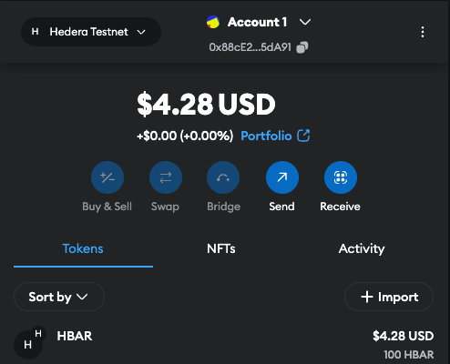
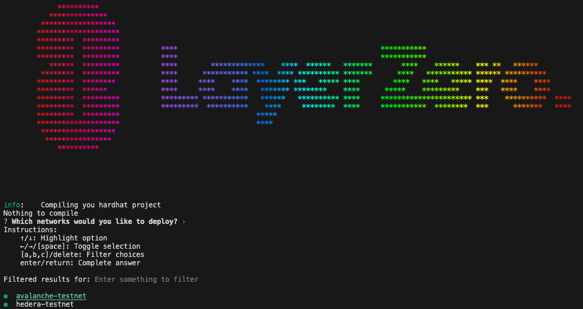
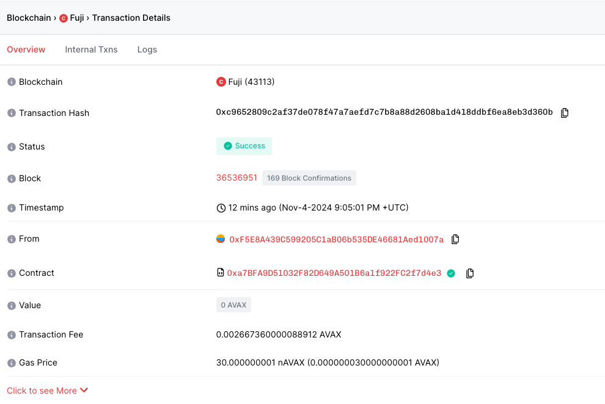

# Send Cross Chain Message from Hedera to Avalanche Testnets Using LayerZero

This repository shows how to use LayerZero with Hedera. It specifically demonstrates how to send a message between Hedera and Avalanche testnets using LayerZero's [OApp (Omnichain Application) Standard](https://docs.layerzero.network/v2/home/token-standards/oapp-standard).

LayerZero's OApp enables communication between smart contracts across different blockchains. It provides developers with a standard message-passing interface, which lets applications like DeFi protocols, DAOs, or NFTs interact cross-chain. Through OApp, a contract on one chain can send data or instructions to another chain. For more details on OApp, see the [References](./README.md#references) section.

## Try It in Gitpod

[](https://gitpod.io/?autostart=true#https://github.com/ed-marquez/hedera-example-layer-zero-bridging-oapp)

| 1a. Add Hedera Testnet to MetaMask                                            | 1b. Add Avalanche Testnet to MetaMask                                                      |
| ----------------------------------------------------------------------------- | ------------------------------------------------------------------------------------------ |
|                                   |                                             |
| 2a. Get testnet HBAR from the Hedera Faucet: https://portal.hedera.com/faucet | 2b. Get testnet AVAX from this faucet (Select Avalanche Fuji): https://faucets.chain.link/ |
|                                         |                                                      |

3. Enter your testnet credentials in the `.env` file. Never share your private keys publicly. Do not commit your `.env` file to a public repository.
   ```
   PRIVATE_KEY=
   ```
4. Deploy the contracts to both chains:

   ```bash
   npx hardhat lz:deploy
   ```

   You should see:

   

   Upon successful deployment, you should see output like the following:

   ```
   Network: avalanche-testnet
   Deployer: 0x88cE2A88D4cdBC2b42D45748eC36103d6875dA91
   Network: hedera-testnet
   Deployer: 0x88cE2A88D4cdBC2b42D45748eC36103d6875dA91
   Deployed contract: MyOApp, network: avalanche-testnet, address: 0x6f5FeD9e63c0fAB53e2Ba1E0e76cA8C62A45758b
   Deployed contract: MyOApp, network: hedera-testnet, address: 0x6f5FeD9e63c0fAB53e2Ba1E0e76cA8C62A45758b
   ```

5. Copy the deployed contract addresses to the `.env` file
   ```
   MY_OAPP_HEDERA_CONTRACT_ADDRESS=0x6f5FeD9e63c0fAB53e2Ba1E0e76cA8C62A45758b
   ```
6. Initialize the OApp configuration (ex Hedera Testnet -> Avalanche Fuji path set in [./layerzero.config.ts](https://github.com/hedera-dev/hedera-example-layer-zero-bridging-oapp/blob/main/layerzero.config.ts). Learn how to set custom config paths [here](https://docs.layerzero.network/v2/developers/evm/create-lz-oapp/configuring-pathways#adding-configurations)):
   ```bash
   npx hardhat lz:oapp:config:init --contract-name MyOApp --oapp-config layerzero.config.ts
   ```
   Select the relevant networks from the list for the OApp configuration.
7. Wire the OApp:
   ```bash
   npx hardhat lz:oapp:wire --oapp-config layerzero.config.ts
   ```
   Confirm `Y` to proceed with the preview and sign the transaction.
8. Move the test file to the `deploy` folder and run the test to send a message between chains:

   ```bash
   mv sendAcrossChainsLz.ts deploy/
   npx hardhat run ./deploy/sendAcrossChainsLz.ts
   ```

   You should see output like the following:

   ```
   Contract address: 0x6f5FeD9e63c0fAB53e2Ba1E0e76cA8C62A45758b
   Wallet address: 0x88cE2A88D4cdBC2b42D45748eC36103d6875dA91

   Test case 1:
   Parameters: { dstEid: 40106, message: 'Hello from Hedera!', payInLzToken: false }
   Quoted fee - Native Fee: 269469144 HBAR, LZ Token Fee: 0
   Adjusted Native Fee: 2.69469144 HBAR
   Estimated gas: 0.000000000000231397
   Transaction hash: 0xd90758d94ce3614048d04332427d49d60aa114cd7d520c4c0b5fb16c64c9d45c
   Transaction confirmed in block: 11378066
   ```

9. With the transaction hash from the previous step, you can view the transaction on the LayerZero, Hedera, and Avalanche explorers.
   | | LayerZero | Hedera | Avalanche |
   |----------|-----------|---------|-----------|
   | Explorer URL | https://testnet.layerzero.network/explorer/avalanche-testnet/0xd90758d94ce3614048d04332427d49d60aa114cd7d520c4c0b5fb16c64c9d45c | https://hashscan.io/testnet/tx/0xd90758d94ce3614048d04332427d49d60aa114cd7d520c4c0b5fb16c64c9d45c | https://testnet.snowtrace.io/tx/0xc9652809c2af37de078f47a7aefd7c7b8a88d2608ba1d418ddbf6ea8eb3d360b |
   | Transaction View |  |  |  |

## Local Setup

1. Clone the repository

   ```bash
   git clone https://github.com/ed-marquez/hedera-example-layer-zero-bridging-oapp.git
   ```

2. Copy `.env.sample` to `.env` and add your environment variables (and Hedera testnet credentials)
   ```bash
   cp .env.sample .env
   ```
3. Install dependencies with `pnpm` (recommended)
   ```bash
   pnpm install
   ```
4. Follow steps 1-9 in the [Try It in Gitpod](#try-it-in-gitpod) section to deploy the contracts and send a message between chains.

## References

- [Create LZ OApp Quickstart](https://docs.layerzero.network/v2/developers/evm/create-lz-oapp/start#deploying-layerzero-contracts)
- [LayerZero V2 OApp Quickstart](https://docs.layerzero.network/v2/developers/evm/oapp/overview)
